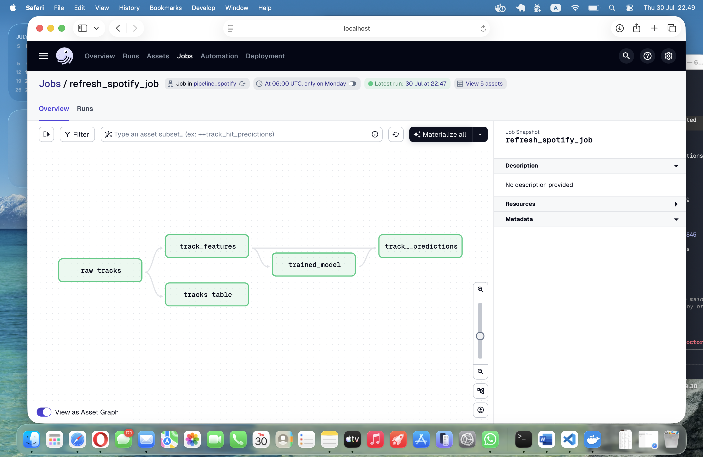

# pipeline_spotify — Spotify Hit Predictor

Predicts whether a Spotify track is a "hit" (top half by popularity) purely
from its audio features (danceability, energy, valence, tempo, acousticness,
and friends). I picked this dataset because its features are all
human-interpretable — unlike a PCA-scrambled dataset — so the trained
model's feature importances actually tell a story about what makes a track
popular, instead of being a black box.

Built on top of [dagster-workshop-multi](https://github.com/DanielAdif/dagster-workshop-multi),
a multi-container Dagster workshop — see below for the base architecture
(`pipeline_products`, `pipeline_fx`, `pipeline_ml`).

## What I built

- **Track:** C — MLOps pipeline
- **Data source:** [Spotify Tracks Dataset](https://www.kaggle.com/datasets/maharshipandya/-spotify-tracks-dataset)
  (Kaggle), ~114,000 tracks, 20 columns of audio features and metadata,
  bundled into the pipeline as `pipeline_spotify/data/tracks.csv`
- **Key assets:**
  - `raw_tracks` — reads the bundled dataset CSV (the raw ingestion asset)
  - `tracks_table` — loads `raw_tracks` into the shared warehouse as a `tracks` table
  - `track_features` — engineers the `is_hit` label (popularity above the dataset median)
  - `track_hit_model` — trains a `RandomForestClassifier` on 13 numeric audio features
  - `track_hit_predictions` — scores every track and writes predictions back to the warehouse
- **Quality gate:** `model_quality_check` — an `@asset_check` on `track_hit_model`
  that fails the run if accuracy drops below 0.6 (the same threshold
  `pipeline_ml` uses). The trained model actually reaches ~0.77 accuracy, well
  clear of the gate, with `acousticness`, `danceability`, `valence`, and
  `speechiness` coming out as the strongest predictors of a hit.

## Architecture

```
                     dagster_webserver (:3000)  <-- workspace.yaml -->  dagster_daemon
                              |                                              |
                              +---------------------+-----------------------+
                                                     |
                             dagster_postgresql  (Dagster's own run/schedule/event storage)

  pipeline_products (:4000)   pipeline_fx (:4001)     pipeline_ml (:4002)      pipeline_spotify (:4003)
  fakestoreapi.com ->         api.frankfurter.app ->   trains a classifier     bundled Spotify CSV ->
  raw_products/raw_orders     raw_exchange_rates       on products+orders,     raw_tracks, trains a
        |                           |                  writes predictions     RandomForest hit
        v                           v                  back                   classifier, writes
  products, orders  --------> warehouse_postgresql <----------+                predictions back
  tables                      (also: exchange_rates,          |                     |
                                order_value_predictions,       +---------------------+
                                tracks, track_hit_predictions)
```

`pipeline_spotify` is self-contained like `pipeline_products`/`pipeline_fx`
(it doesn't read any other pipeline's tables) but follows `pipeline_ml`'s
train/evaluate/predict pattern instead of a plain ingestion pattern.

## Running it

```bash
docker compose up --build
```

Open http://localhost:3000, find `pipeline_spotify` under Deployment > Code
Locations, and materialize its assets.

## Demo



Asset graph for `refresh_spotify_job`: `raw_tracks` feeds both `tracks_table`
and `track_features`, which trains the model and scores predictions. (This
screenshot was captured during development, before the trained-model asset
was renamed from `trained_model` to `track_hit_model` to avoid a key
collision with `pipeline_ml` — see "What I'd do differently" below for more
on the debugging that surfaced.)

## What I'd do differently in production

This workshop-scale pipeline simplifies several things a production MLOps
system would need: the trained model is passed between assets as an
in-memory pickled dict instead of being logged to a proper model registry
(e.g. MLflow); tables are truncate-and-loaded on every run instead of
versioned incrementally; warehouse credentials are plain environment
variables instead of coming from a secrets manager; and a failing quality
gate just fails the Dagster run instead of paging someone. I also hit a real
containerization bug worth calling out: `RandomForestClassifier(n_jobs=-1)`
spawned joblib worker processes *inside* an already-forked Dagster step
subprocess, which exhausted Docker's default 64&nbsp;MB `/dev/shm` and
silently killed random steps with no traceback — fixed by training
single-threaded, since training only takes ~4 seconds either way.

---

# dagster-workshop-multi

A multi-container introduction to [Dagster](https://dagster.io) using the
real production pattern: one Docker container per pipeline, each running its
own Dagster gRPC code server, registered with a central webserver/daemon via
`workspace.yaml`.

## Prerequisites

- Docker Desktop (or Docker Engine + Docker Compose)
- Internet access (`pipeline_products` and `pipeline_fx` call free public APIs)

## Quickstart

```bash
docker compose up --build
```

Then open http://localhost:3000. Under Deployment > Code Locations you should
see `pipeline_products`, `pipeline_fx`, and `pipeline_ml`, each its own
container. Select all assets and click "Materialize all" to run all three
pipelines end to end — `pipeline_ml` trains on the data the other two just
loaded, so it needs to run after them at least once.

## Verifying a run

- **In the UI:** every asset in the graph should turn green. A red asset
  means its run failed — click it and open the run logs for the error.
  `model_quality_check` (under `pipeline_ml`) should show a passing check;
  a failing check means the trained model's accuracy dropped below the 0.6
  threshold — click it in the Asset Checks panel to see the reported
  accuracy.
- **In the warehouse:** connect to the shared Postgres directly and confirm
  data actually landed:
  ```bash
  docker compose exec warehouse_postgresql psql -U warehouse_user -d warehouse -c "\dt"
  docker compose exec warehouse_postgresql psql -U warehouse_user -d warehouse -c "SELECT COUNT(*) FROM order_value_predictions;"
  ```
  You should see `products`, `orders`, `exchange_rates`, and
  `order_value_predictions` tables, each with rows.

## What just happened

```
                     dagster_webserver (:3000)  <-- workspace.yaml -->  dagster_daemon
                              |                                              |
                              +---------------------+-----------------------+
                                                     |
                             dagster_postgresql  (Dagster's own run/schedule/event storage)

  pipeline_products (:4000)          pipeline_fx (:4001)          pipeline_ml (:4002)
  fakestoreapi.com ->                api.frankfurter.app ->       trains a classifier on
  raw_products/raw_orders            raw_exchange_rates           products+orders, writes
        |                                  |                      predictions back
        v                                  v                            |
  products, orders  ------------->  warehouse_postgresql  <-------------+
  tables                            (also: exchange_rates,
                                      order_value_predictions)
```

Each pipeline is a fully independent container: its own `Dockerfile`, its own
`requirements.txt`, its own source/db modules. They only share the
`warehouse_postgresql` database as a landing zone — exactly like production's
21 pipeline containers, each pulling from its own source system into one
destination database. `pipeline_ml` is the odd one out: instead of pulling
from an external API, it reads `pipeline_products`' tables straight out of
the warehouse, trains a classifier, and writes predictions back — see
[docs/mlops.md](docs/mlops.md) for why Dagster's asset/asset-check model
fits that pattern too.

All three pipelines write with a simple truncate-and-load (`if_exists="replace"`)
— a simplified stand-in for production's shift-based "check-then-insert"
pattern.

## Running the tests locally

Each pipeline has its own test suite, independent of Docker — tests mock
the external API calls and the warehouse connection, so no running database
or containers are needed:

```bash
cd pipeline_products && pip install -r requirements.txt && python -m pytest -v
cd pipeline_fx && pip install -r requirements.txt && python -m pytest -v
cd pipeline_ml && pip install -r requirements.txt && python -m pytest -v
```

## Exercises

See [docs/exercises.md](docs/exercises.md) for three hands-on TODOs, in
increasing difficulty. Each one has a `# TODO(exercise-N)` comment marking
where to add your code.

## Capstone

Once you've finished the three exercises, see
[docs/capstone.md](docs/capstone.md) for a bigger, open-ended assignment:
build and wire in your own pipeline, in your own fork, and turn it into a
portfolio piece.

## How this maps to the production pipeline

This is adapted from a real Dagster + Docker production system with 21
pipeline containers pulling manufacturing data (OEE, downtime, QC) from
internal MSSQL/AS400 systems into a central SQL Server database. This
workshop keeps the core architecture — one container per pipeline, gRPC code
servers, `workspace.yaml` registration, a shared destination database — but
swaps the internal systems for free public APIs, and drops production's
`DockerRunLauncher` (which spawns a fresh container per run via a mounted
`docker.sock`) in favor of Dagster's default run launcher, where runs execute
in-process within each pipeline's own gRPC container. See
`dagster-workshop-basic` for a single-container introduction to the core
Dagster concepts before diving into this multi-container version.
